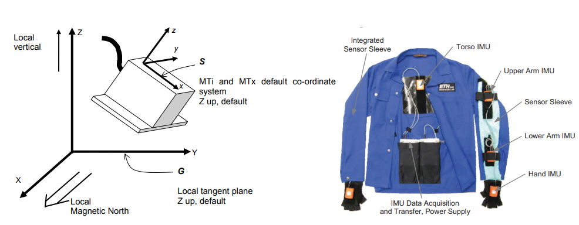

## 7/7/2021:
- The THREE.js scene now loads when the Viewport is first initialized, and the individual visualizers just reset the model.
    - There's strange behavior because setting state in react doesn't take effect until the next render. The Viewport provides a Promise in its props that is fulfilled when the THREE scene is loaded, but none of the props have changed to reflect the new scene by the time the promise is first fulfilled.
    - To mitigate this, I've changed resetModel to not do anything if the 'bones' property is null. This is fine as long as the model starts with the right position.
- I still need to modify the comments on NetOps to match the new props requirements.
- I am trying to figure out why the labs don't open. Setting the `fileStatus` prop to "Complete", which is how we activate the visualizer, doesn't change the FileViewer's appearance. This is super confusing since its output is a function of `fileStatus`.

## 7/3/2021: 
- How to run the production build of the server on any machine:
    1. Run `npm run build`.
    2. Run `node server.js`.
    - Note: that this might make the server listen on port 5000. We might need to adjust `server.js` to make sure we're listening on the correct port, and we definitely need to adjust it to handle http requests (not 'secure') and redirect them to the https server.
    - Other note: The 'dev' version of /visualizer might be unavailable because I removed the `exact` keyword in the router for /visualizer in order to accomodate queries (not sure that's necessary!).
- The problem from yesterday had to do with Socket.io's handling of URLs. I was passing in `window.location` as the URL, but for some reason that was resulting in a GET request being sent to the server, which then responded with delivering `index.html` which redirects us to the main visualizer page.
    - The fix: Just pass in the options when initializing a Socket on the client side -- **do NOT pass a URL in to the Socket initializer**.
- There was another crash that only happens in the production build where `lineNumRef` was not reset to 0 when the `lineNumber` prop was, so the PlayBar automatically set `lineNumber` to be whatever `lineNumberRef` had been before loading the most recent file. Now it's fixed (I think).

## 7/2/2021:
- I have been testing the server to see whether it would work on the VM by just running `node server.js` and serving the built `index.html` file. Once we have a way to run the files on the VM server, we're good to merge.
    - The problem is that clicking a file to view causes the page to reload as soon as `onSelectFileChange` starts executing in `FileOps.js`. The very first line, which sets `props.data.current` to 0, causes the reload, and the reload doesn't include any query params, just `/visualizer`. Why does this happen when I server through the node server but not in the development build?
        - This might be fixed by serving through whatever works best for React, and using a separate node server to handle API requests. We could have both servers on the same machine.

## 7/1/2021:
- I've added many more commits to `serverside_processing` to make a Gradescope-like system of file uploads and progress reports. I integrated all current changes to master, but I still don't want to merge because new problems keep appearing that need to be squashed.
    - Given the progress I have, I promise to make a merge request by the end of Saturday. Ideally we could review it together to go over the changes because there are quite a few, and I want to annoy Jonathan with the changes to visualizer **before** I upload rather than after.
    - There are now quite a few redundant files:
        - The `visualizer_experimental` directory should be merged into `visualizer` and overwrite any overlaps.
        - `FileProcessor.js` in serverside is unused.
        - There are unused functions in `FormFileProcessor.js` in server side.
        - `server.js` has unused functions and unused/outdated HTTP request handlers.
    - I want to know whether things will work on the remote server **before** the merge, and the only way I know to do that is by `git checkout serverside_processing` on the remote server and seeing what happens.
- Remaining issue: when you upload a file, get redirected to the viewport, and load in the model, the model shows the first transformation in the data but does not react to moving the time slider. Then, switching to another data file and back will cause things to behave as expected.

## 6/26/2021:
- The Visualizer component now shows up as the final state of the file viewer, and it correctly portrays the THREE scene (including changes to the model!) and has orbit controls. The client fully downloads whatever file was passed in as props to the new Visualizer component, then fully animates it just like before async loading was added.
    - Major features waiting for implementation:
        - The randomly-generated pseudo-private keys are not yet used by the socket code & server for retrieving files.
        - The upload form should bring the user to the visualizer with the relevant file selected.
        - The 'time column' parameter is assumed to be 0 on the client side and is not used. That's a simple fix.
    - The crashes that happened last time the server tried handling the full 50MB data file have an unclear cause. The server must be able to handle those before any pull request.
    - The redefined networking operations added to FileOps.js should be moved to NetOps.js, but I feel that NetOps should change to be more function-oriented. Right now it returns its values by modifying props, which makes it tough to tell its exact job.
- We are behind on general documentation (from what I can tell) and my efforts are not contributing to that. I need to put serious work into prettying up the code before the pull request -- there are a lot of old commented methods, in-line comments, overly nested chains of async callbacks, etc.
    - VSCode supports [JSDoc](https://www.google.com/search?q=jsdoc&rlz=1C1CHBF_enUS905US905&oq=jsdoc&aqs=chrome..69i57j0l5j69i60l2.1264j0j7&sourceid=chrome&ie=UTF-8) as Jonathan pointed out in a recent meeting. I plan on making heavy use of that. Public functions without any explanation are needlessly tough for other programmers to use.
- I'm getting more familiar with the codebase and the various workers. It helps that I'm finally learning how to use VSCode for navigation in sprawled out projects.

## 6/25/2021:
- I have still had a lot of trouble messing around with the visualizer, but I've understood its concepts and could definitely replicate it. I should probably ask Jonathan to clarify things.
    - I've finally managed to use a THREE scene as the final component after the sequence of loading messages on the landing page. The model in this scene is visually modified in a reasonable way by `batchUpdate`, so I just need to connect the file selection and interpretation to it and we're set. This isn't pushed to Git, and I'd like to talk with Jonathan first so that I'm not stripping away required Visualizer functionality.
    - I realized I could save some time by re-creating Visualizer (relying heavily on original Visualizer code) rather than attempting to modify it and dealing with the fallout. I've split the Visualizer into a Component that renders the THREE scene to the DOM, and a React-independent library that generates the scene. 
        - Will this be problematic if we want to use a different model? Probably not, since we can just use isomorphism to call a different external scene creation library.
    - I wasn't able to get the scene to re-render upon `prop.modelNeedsUpdating` being modified, but I can just use the native THREE animation loop that calls itself through `requestAnimationFrame` and it will always react to updates. I hope that isn't too slow -- that's how it's done on the home page.
    - I'm confused at how the visualizer maintains its scene after the first render--it has a flag saying that the scene has been created/model has been loaded, and it only creates the scene if that flag is false, but where does it get the scene upon rendering in that case?
    - It's tought to track down what elements of Viewport's state belong to which files, which gets to be a problem when one component depends on another setting a certain state component in order to not crash.
- Another note: I don't like the really slow-motion feel when playing the opportunity dataset. The fast way to speed it up is just to (1) increase framerate and (2) skip frames (since we don't need it to be really smooth). I want to see the clapping in real-time, for the cool factor.

## 6/24/2021:
- After the meeting I tried to modify the Viewport page to only use a Visualizer component conditionally, so that I could fit the Visualizer in as the final stage in the logic on the `FileViewer` component. 
    - I want to use the Visualizer component with appropriate parameters as a return value for a function which I can place in the JSX DOM returned by Viewport. However, this results in the model and grid not appearing onscreen after loading is complete. I do not know why.
    - I've made some test code locally to test using a THREE.js scene as a component, and it is definitely possible to make an object-oriented version that can be swiched out as a function result on rendering.
        - So either (1) I am improperly passing properties to the function that returns the HTML component, (2) it works with object but not functional components, or (3) it is something else that I don't understand. The 3rd one is very possible.

## 6/23/2021:
```
- code to do something after 5000 ms:
//Purely for debugging!
function sleep(ms) {
    return new Promise(resolve => setTimeout(resolve, ms));
}

//Also for debugging: send timed response to client
async function respondToClient(socket) {
    await sleep(5000);
    socket.emit("file status", { status: "Processing" });
}

todo:
- DONE create a standardized messaging system for each of the possible states.
- create a basic look for each state in the client side component
- hook up the messaging system on the server side to file status (may need more decisionmaking)
- make client side do a GET request upon seeing that the status is good (note: it can do this erroneously!)
- make client side actually visualize the data like a viewport

- standardized messaging system
	- refer to the possible states. which ones are related to the socket.io messages:
		1. we're working with your file (processing)
			'Processing', { progress: <is it possible to put a progress messag here?> }
		2. there was an error (should include error message)
			'Error', { errMessage: <error message goes here> }
		3. your file is ready for downloading
			'Ready', { no REQUIRED info }

		No, it would be better to make 3 different types of message, a.k.a 'chat message' vs 'contents'

question: is it really okay to use the NAME of the message type and parameterize that, or should I make these all a category based on what webpage?
	- probably the latter, since we have no other top-level differentiation. What if there's another type of 'file ready' on some other page?

next thing to do: 
	- (DONE) change from 'loading the data file' state to 'done loading the data file' state, then disconnect
	- modify all calls to changeState to take in a relevant argument (like the error message for err)
error checking i know i will need to implement:
	- when a Get request for a data file happens, ensure that the file is ready and send an error if it's not
	- get request for either metadata, or for quaternion data fails. If either fails, we should error ourselves out.

"errors" remaining:
1. (DONE) submitting the form takes you to the main menu instead of to the file viewer.
2. the landing page doesn't reference the right file. probably should use queries.
	- which means we should use the http post response.```

## 6/22/2021:
- I worked a little bit on a page that allows the user to ask for the progress of a remote file and get the file if it's done. I realized that we need file-specific updates, asynchronously, from server to client. 
    - I imported the [socket.io](https://socket.io/) library and modified server.js to be compatible with it locally. It allows the required asynchronous updates, so I'm working on that now.
    - The possible states for the user are:
    	1. we're still loading the model
        2. we're contacting the server about the model
	    3. we're still working with your file
	    4. we're loading your file over the internet
	    5. there was an error, don't expect your file (done)
	    6. your file has been processed, and here it is! (done)
    - ...so the tasks are to (1) make views for each of those states, and (2) make it possible to show those views as a result of state. I'm mainly working on (2) because it presents new technical challenge.
    - URL params will be used to pass the file name argument, and sockets can authenticate users (somewhat) so that users aren't getting each others' files broadcasted to them -- they are unlisted, ideally. 
        - Jonathan suggested deleting files upon exiting the website, and I think that would be possible by deleting upon the closing of a socket, if sockets are managed on a per-user level.
    - Since sockets here are not really meant for transporting large files and GET requests are, a certain message from the server should trigger a GET request in the client which sends the file.
- I also tested out putting queries in `xmlHttpRequest` objects and it's pretty simple. I haven't yet pushed the code since I want a working demo for the file viewer page before that.
- Right now the server stores all the data from the python program in local memory when it passes it to the callback function in `server.js`. This means it can probably only hold so much at once, so it might be better (albeit maybe slower) to always pass data using files.
    - Using a GET request will solve the entire dumb problem of stuffing all the quaternion data into an HTTP POST response, which is what's going on with the upload form right now.

## 6/21/2021
- Small design thing I don't like: The metadata and file creation are almost independent, and they both have to conform such that the column numbers listed in the output file correspond to the ones in the metadata file. Is this a problem, or is that a reasonable interface?
- Some notes from today's work, which was a continuation of yesterday's task of implementing server side data writing from form inputs:
```
things to do:
1. in python backend, make the factory data-driven somehow
2. (DONE) add form validation to calibrationform
3. (DONE) make submit button in calibratinoform actually work (not really tested hard)
4. make scrolling possible in calibration form
5. refactor calibration form to use defined components to avoid clutter
6. allow user to give custom name to their file, and use that custom name in the file browser
7. allow user to upload multiple files with the same specifications
8. make user go to relevant visualizer after submitting their file
	it is like Gradescope. it either says 'currently processing', or it shows the actual thing
	idea from jonathan: 1) it's unlisted and 2) it requires a randomly generated key sent by the server
	also idea from jonathan: delete when session ends. but how?
9. ensure that the server-side error handling works
10. allow client to detect when the problem is that the server's down

section of website with submissions: /files/userupload/<file identifier>
- user sends post req with file and data
- server accepts, starts processing, sends response:
	- identifier for what file to look for
	- password-like thing? (not secure if plaintext)
- client navigates to /files/userupload/<file identifier> with GET request
	- server sends message based on status of upload: either loading, error, or complete.
```
- Note that the Gradescope UI is one inspiration for combining forms, files, server-side processing, and user-based access.

## 6/20/2021
- I've expanded on what I was working on yesterday. I made the form in Material UI using the Grid component to try add some order. I'm still new to styles for web UI, so it's not great, but I have retained the ability to construct and send metadata.
- On the server side, I've added an interface for new Python classes corresponding to getting quaternions from various data types (or using various methods). It's not done yet but it will add the ability to interpret uploaded quaternions.
- I still need to ask Jonathan about what happens in the user experience after they submit a file. Should they be taken directly to viewing, or should they just be able to pick the file from a browser?

## 6/19/2021
- I've been working on a very simple calibration form that sends data in JSON form. It allows a variable number of items and some format specification. Now I just need to ensure that the server side processing part of the server can handle it.
    - I want to add additional validation so that it's harder to send garbage data. That said, the server should also be able to handle garbage data since the message can be changed between client and server.
    - I want to make it look prettier using materialUI so it fits in with the theme of the rest of the project. I might want to even make it a dialog popup like the one on the main page.
    - There should be a way to enter local transforms. For now it can be done with sliders/number inputs, but with infinite time, I would put a little viewport that lets you rotate a sensor relative to the model in 3d space.
- I then made a submission handler that makes the form do a POST request to the server, which then processes the incoming file and stores it locally in `files/user-uploads`. It stores the raw data (with some comment lines marked with '#') and a metadata file in the format on the master branch.
    - The server currently treats all incoming data as gyros. It can skip to storage for quaternion measures, but since we can have a mix of gyro and quaternion, we should probably do processing anyway (we can eliminate unnecessary data columns).
    - I'm not sure where you should go after submitting the form, or what steps the user should take to access the data they just uploaded.
    - The filename is just based on the upload time for uniqueness. I don't know of how we should arrange deleting cached files or metering the amount of files one user could upload.
    - The server sometimes hangs after a file upload, which suggests there's some kind of infinite loop? When I use `ctrl+C` to end the program during a hang, it just goes back to working.
    

## 6/14/2021
- Here's where I am leaving my current progress on the ServerSideProcessing lab:
    - I have successfully moved computation for gyro to quaternion to a Python library running on the server. I have successfully animated these integrated quaternions with the Python visualizer to confirm that they are similar to the quaternions from the Opportunity dataset. I have not successfully animated them on the model.
    - I made the React client forward all HTTP requests to localhost:80, so I'm hesitant to push my changes in master since the React proxy should be whatever server sent the React code in the first place, which is not the local machine running the code.
- Note for myself for future reference: The command `python graph-animate-transf.py data-samples/fusion_output_S1_Drill.dat --o 0 --max 900` will graph the test data that was generated by Micropython-fusion. Compare that to the given quaternions by also running `python graph-animate-transf.py data-samples/S1-Drill.dat --o 85 --float --max 900`.
- I am trying to make sense of the quaternions from Micropython fusion that are getting sent back from the server, and I know that the LUA is pointing up when it should point down, which means I'm messing up my transforms on the client side that allow the data transforms to take place.
    - Some quick inspection confirms that the data quaternions are the same between both, so it's definitely the fault of the setup quaternions. This doesn't make sense to me, though, since a data transform of (0,0,0,1) correctly sets the arm to point in the positive z direction with local sensor up equal to global up.

## 6/12/2021
- I've ported the functionality from my spike test to a Lab on the website. Now you can upload a file and it will automatically send the necessary parameters as JSON so that the server can run Python code that uses the Micropython fusion package. The final quaternions are sent as a response message to the POST request.
    - This shouldn't be a POST request unless we're actually uploading the file to the server. I guess it should be a GET request if we're just asking for remote processing.
    - To test it out, I need one console running `npm start` for the React server and a second console running `node server.js` (or one running both in background). With compiled/minified code, we just need to run the node server since it can deliver the React page as HTML.
    - I had to add `"proxy": "localhost:80"` to the bottom of package.json in order to let HTTP requests to the server's API work, since otherwise an `xmlHttpRequest` will automatically be sent on the port of the server that's sending it (3000 in this case). The other option was to have the server host itself on port 80 during developer build testing, but I don't know how to do that.

## 6/10/2021
- I looked at how to create and send a POST request with a file and parameters from a React client to a server, then use the data from that file in a `child_process` Python program and return the output. The prototype is in `spike_websocket/react-node-server`.
    - There is a dividing line between 'server' and 'client' code, but we are similar to the existing server in that we can build, then run a node server that delivers the resulting React HTML.
    - The main issue is that for really big files, piping them into the Python program is annoying, since you can't pass them in as a string. I can pass the lines in one argument at a time, but I don't know how long that takes compared to processing the data in pure JS. 
        - Things are promising, though, since they most computation was just spent printing the data to the console upon receipt (server-side), and that won't happen in production. Sending 50MB was pretty quick, and I'm hoping that it wasn't just a passed reference.
    - Next I plan on porting the same design to the real react server and making some component to test sending a packet to the running node. The role of `index.js` will be served by `server.js` and the role of the client is filled by the rest of the app.

## 6/9/2021
- Today I looked at two major things: Using non-Javascript modules for computation, and moving computation from the front to back end. This has also led me to better understand React, but I'm still frustrated by not knowing what exactly React does when I type `npm start`. 
    - For the first objective, we can just use the Node package `child_process`, which lets us run terminal commands and use their stdout. Hopefully that lets us run things faster since we can use Numpy or actual C code, but printing to stdout is probably going to be the most computationally intensive part.
    - For the second objective, the goal is to complement React (a front-end library for making pretty apps) with a Node/Express backend that accepts data and returns transformed data quickly. I'm currently following [this guide](https://www.freecodecamp.org/news/how-to-create-a-react-app-with-a-node-backend-the-complete-guide/).

## 6/7/2021
- I've made an additional Lab that uses simplifies Madgwick estimation for gyro data to display movement for the left upper arm with the ADL data. Based on S1-Drill data, the algorithm used is somewhat accurate but doesn't estimate the *initial global position* of the arm, so the movements are not realistic. 
    - The full Madgwick algorithm uses magnetometer and accelerometer data to estimate global position but I'm still learning the implementation.
- I found [one online sensor integration library called micropython-fusion](https://github.com/micropython-IMU/micropython-fusion) (MIT license) that uses the Madgwick method from 6/5 and have imported it into the sample-test-data folder of the repo. I then modified an example test script to make `sample-test-data/micropython-fusion-master/fusiontest_opportunity.py`, which makes a file of (w,x,y,z) orientation quaternions that can then be animated using `graph-animate-transf.py`.
    - I tried the generated data with the left upper arm and compared it to the quaternion data, and they agree qualitatively but are a bit different in detail. I think this is definitely a good enough algorithm to faithfully display the data to the client so they can see what's going on in the dataset and whether there's any major errors.
    - The library designed mainly for a specific type of hardware called MicroPython, but as long as you pass in a custom function for time intervals between sensor readings, you can use it for any accelerometer+gyro+magnetometer data.
    - Everything is hard-coded in the current version of the script I made. The directory structure is also not great. I would also like to move away from python files with dashes in their names since they are harder to import.
- Using a package for computation makes me ask a big question. Where should the transformation from sensor data to quaternions take place: On the client's machine in JS, or on the Linux server with Python/JS/C++/C? I like the idea of moving the computation off of the client's machine, but I don't yet know how that is done.
- Estimating gravity direction allows us to estimate the sensor's pitch, which helps place it in the global frame. I can estimate gravity direction in a data file by taking the average acceleration over a long time, but I don't really trust this because gravity direction is affected by orientation.
- I should probably do something about the bloat in the number of python files in this folder, but this is probably normal for a scratch pad repo. I could make it cleaner with some object-oriented system for classes that turn data files into quaternion arrays, but I'll only do that if Python code could potentially be used directly.
- Lastly, for calibration and parsing multiple types of files, I've made a proposed configuration file format using JSON that can be used alongside a raw data file so we can parse it without hard-coding any column numbers or bone names (see `calibration-metadata/opportunity_example.json`) for the defining example.
    - I have not got a notion yet for what interface will be used to generate this file.

## 6/5/2021
- [This paper](http://vigir.missouri.edu/~gdesouza/Research/Conference_CDs/RehabWeekZ%C3%BCrich/icorr/papers/Madgwick_Estimation%20of%20IMU%20and%20MARG%20orientation%20using%20a%20gradient%20descent%20algorithm_ICORR2011.pdf) has one proposal for integrating gyro data accurately and links to a bunch of other potential methods. Since the gyro data I'm curretnly making is (i) quite exaggerated and (ii) depends on the ordering when I compose the rotations about individual axes together, I'm still looking to new methods.
    - There's a C++ implementation [here](https://github.com/arduino-libraries/MadgwickAHRS/blob/master/src/MadgwickAHRS.cpp), and it optionally involves magnetometer and accelerometer data also.
    - It's constrasted from a 'Kalman filter' which I need to look into because it seems to be pretty ubiquitous in sensor fusion.

## 6/4/2021
- Correction to myself on how coordinates work for OPPORTUNITY: the y-axis represents local sensor LEFT, not local sensor right. I can tell by the diagram on page 10 of the manual.

## 6/3/2021
- I decided to look at using the gyro data. There are three data points, gyroX, gyroY, and gyroZ, and based on some general reasearch and information from the more recent Xsens manual (not the one linked on the OPPORTUNITY website) it seems that these represent the rotation about the local x, y and z axes.
- Using this information I created a composition of three quaternions and applied them at each time interval, so that I could estimate the orientation by simulating each recorded angular velocity.
    - Since this is basically Euler's method for integrating, I probably have an expected error on the order of h^2 where h is the time step, which means things could get out of hand very quickly.
- I got my current results with the command `python graph-gyro-data.py data-samples/S1-Drill.dat --offset 53 --maxlines 500` using the new Python program. Compare them to the animated results for the same bone (RUA) to see what is the same and what is different.
    - It seems that the magnitude of the movements is off by a significant margin compared to the quaternions. However, We still see the bouncy movement in an arc around the body, AND there's that odd loop at the top of the path in both versions. Really promising.

## 6/2/2021
- I'm looking at possible datasets for extending the project. The main source is the UCI machine learning dataset repository, and Karen and Charlotte [already sorted](https://docs.google.com/spreadsheets/d/17MQfr9Dy6LU3BbPSYQeYLCg20x13Vyc8chQxOFLT3xQ/edit#gid=0) the major HAR ones by citation.
    1. [Human Activity Recognition Using Smartphones Data Set](https://archive.ics.uci.edu/ml/datasets/human+activity+recognition+using+smartphones)
    - It has no quaternions but it does have lots of accelerometer data and data about the angle between gravity and the Samsung smartphone basis vectors. This is hard to apply to the model because it [just has one sensor](https://www.youtube.com/watch?v=XOEN9W05_4A) which indicates where the torso is facing--no joints. We probably want something with a relationship between limbs and body.
    2. [WISDM Smartphone and Smartwatch Activity and Biometrics Dataset Data Set](https://archive.ics.uci.edu/ml/datasets/WISDM+Smartphone+and+Smartwatch+Activity+and+Biometrics+Dataset+#)
    - There are two sensors: one on the dominant wrist (a smart watch) and one on the body (a phone). This means that we have some relationship between limb and body, but things will look very distorted when the arm is bent because we can't tell how the segments of limbs are oriented.
    3. Kasteren dataset
    - I haven't fully looked into this one since it's harder to get documentation on what sensors are involved. The download requires me to run a MATLAB script to view it so I may try that later on.
    - [One MDPI paper](https://www.mdpi.com/1424-8220/20/9/2702/htm) states that Kasteren is just environmental sensors.
- Since Karen and Charlotte already listed which datasets have a skeleton, I'm going to proceed starting with those ones.
- It's best to find ones that have quaternions, data on the per-joint level, and also ones that use Xsens sensors would be especially great since we have some experience on how they work.
    1. Cornell Activity Datasets CAD-60
    - This one is super promising because it reports orientation of joints all over the body, in rotation matrix form. Sadly the links to it don't seem to be working, so it might have been taken down.
    2. [CASAS HAR datasets](http://casas.wsu.edu/datasets/)
    - The first one on the list uses ambient motion sensors instead of sensors on the target's body.
    - Item 18 on the list has wearable accelerometers on the right hip, dominant wrist, non-dominant upper arm, dominant ankle, and non-dominant thigh.
    3. [Daily and Sports Activities Data Set](https://archive.ics.uci.edu/ml/datasets/daily+and+sports+activities)
    - It has one unit each for torso, arm and leg. There is accelerometer data, gyro data and magnetometer data. The documentation is fairly sparse but I will look at papers about it.
    - [The paper introducing this dataset](http://kilyos.ee.bilkent.edu.tr/~billur/publ_list/cj14.pdf) shows that it also uses Xsens sensors which is very good news. There's also figures showing where they are on the body.


- Update on notes from two days ago: Sophie and I agree on all this and she has implemented it (indepenently) with the actual dataset. It turns out you can treat almost all of the bone the same way.

## 5/31/2021
- I recycled the functions from the python animator into a quick tester for quaternion transformations to see what set of transformations will get from sensor space to three.js space.
    - For quaternion **q = (w,x,y,z) = (1/2, -1/2, -1/2, -1/2)** and vector **v** in OPPORTUNITY space, **qv(q^-1)** is the corresponding vector in THREE space. This agrees with what Jonathan said and is demonstrated quickly by `../sample-test-data/utils/quat-operations.py`.
    - By OPPORTUNITY space, I mean that x points toward the camera, y points to camera right, and z points up. By THREE space, I mean that x points toward camera right, y points up, and z points toward the camera.
    - When I use this transformation in Sophie's lab from today (which is really promising) it does NOT cause the orientations of bones to be **qv**. I haven't tried it yet with one bone at a time. 
    - This probably has to do with the parent-child connection between bone orientations, but I thought that was accounted for because we're using global-to-local translation and the bones are manipulated in topological order (parent before child).
- I've just pulled Jonathan's log from 5/30/2021 and read it for the first time, and it looks like he has already used a similar quaternion to transform the coordinates and has done a bunch of tests, so I need to catch up with that.
- He used both pre- and post-multiplication to transform from OPPORUNITY global to THREE, based on the following snippet:
    ```js
          /* Transform our coordinate system */
          q.premultiply(new THREE.Quaternion(0.5, 0.5, 0.5, 0.5));
          q.multiply(new THREE.Quaternion(0.5, 0.5, 0.5, -0.5));
        
          /* Rotate the back to the correct initial position */
          q.premultiply(new THREE.Quaternion(-0.707, 0, 0, 0.707));
    ```
    - I should probably ask about this. Since we're multiplying two quaternions, we can just use the hamiltonian product of (0.5,0.5,0.5,-0.5) and **q** without having to both pre- and post-multiply.
- Last thought: What we should do is get in a situation where every bone is aligned along the x-axis. Then we know how to transform that into what was measured in the dataset--we just apply two quaternions.
- I just put this to the test in a new 'Sam 5/31' lab using the generated data which makes the bone go in a cone shape pointing toward positive x. As long as I first point the bone along the x-axis, I can then apply the transformation that points the local x-axis where I want it to go. The transformations for LUA are as follows:
    - Rotate 90 degrees CW (-270 CCW) along the z-axis, to get the arm pointing in the x-axis
    - Rotate 90 degrees CCW along the x-axis, to get the top of the arm pointing in the y-axis
        - The composite of these is **q**= (w,x,y,z) = (0.5, 0.5, 0.5, -0.5), or a 120-degree rotation CCW about (1, 1, -1).
    - Apply the quaternion from the dataset
    - Rotate 120 degrees CCW about (1,1,1), to switch basis between the OPPORTUNITY global space and that of THREE.js.
- If we can come up with transformations to point the bone in the positive x direction, we can then reliably apply OPPORTUNITY data. This is kind of punting the problem, though, since we still need to know how to point a bone in a direction. Every bone has its own default direction, and I'm not sure where it is written. Jonathan or Sophie might know.
    - Using the quaternion (0, 0, 0, 1) on every relevant shows that their default directions are all along the positive y axis, so that's convenient. However we at least have to use different quaternions for determining the correct 'up' direction for the arms.
    - A big challenge here is managing parents and children. We need to make sure that we can control the DIRECTION of a parent bone and child bone independently (but their positions should be tied together based on the orientation of the parent).
        - The strategy here is that for every quaternion applied to the parent, the opposite should be applied to every child. Is this already done by the ripple thing?

## 5/30/2021
- I modified the file to use labelled command line arguments with optional flags.  I can still  produce the same output using `python graph-animate-transf.py data-samples/S1-Drill.dat --o 59 --max 2000 --float`.

## 5/29/2021 
- I've changed my mind about the transformations based on page 17 and page 20 of the [manual](http://www.opportunity-project.eu/system/files/MTi_and_MTx_User_Manual_and_Technical_Documentation.pdf). It says that the sensor coordinate system *S* is described **in  reference to** a world coordinate system *G*, and the rotation matrix uses the coordinates of the basis vectors of *S* in *G*-space as its columns, so the transformation must be from *G* to *S*.
- I just tried out the visualizer from testing custom data, with the right upper arm data from subject 1's drill run. It's really promising and I posted it on slack and saved it. I used the following command: `python graph-animate-transf.py data-samples/S1-Drill.dat 59 float 2000`. I really need to clean up this program because it is legitimately very useful.

## 5/28/2021
- Putting logs in reverse order of date now so that adding a new entry doesn't require scrolling all the way through the log.
- What have I promised for the meeting today? What do I plan on working on between now and Tuesday?
    - I will modify the code for generating/visualizing sample data so that the quaternions represent transformations **from local to global** space. Right now they are the other way around.
    - I will look into what we are missing between THREE.js space and OPPORTUNITY space in order to accurately transform an orientation from global opportunity space to global THREE space.
        - The best candidate for this transformation is a rotation around (1,1,1) of 120 degrees.
    - I will work with someone else to test out ideas for that.
    - I want to put some of the actual datset through the python visualizer to see how coherent the data is. It should give us a hint about what the orientation is supposed to look like on the webserver.
    - I briefly mentioned the idea of automatically pulling on the server whenever there's a push to master. If I want to look further into that, there's [a PHP solution from stack overflow](https://stackoverflow.com/questions/10542158/how-do-you-do-an-automatic-git-pull-on-remote-server/18053061).

## 5/27/2021
- I decided to go back to making sample data, since now I have more understanding of the format of OPPORTUNITY data.
    - A flaw with the previous format was that I didn't know what was represented by the 'twist' (w) component. 
- This time, I'm using a target 'up' and target 'forward' direction to construct a rotation matrix, which then gets transformed to a quaternion and put in (w,x,y,z) format like in the xSens readings in the dataset.
    - The procedure for generating the data is in [generate-reference-transf.py](../sample-test-data/generate-reference-transf.py) in the `generate_data_new()` function.
- The only good data right now is in [the sample data folder](../sample-test-data/data-samples/circle-with-up-control.txt). It has the same motion as last week, but with the extra constraint that local 'up' is always tangent to the circle.
- There's also a really ugly coded [python program](../sample-test-data/graph-animate-transf.py) which animates the (approximate) position, direction and orientation of the sensor given a file with quaternions in (w x y z) form. I'm considering trying it on some of the actual OPPORTUNITY dataset soon.
    - The program takes the text file you want to read as a command line argument.
- Now that I trust the data that has been generated, I want to see it on the model. When I use it directly, there are some strange effects, but the location of the arm definitely agrees with the expected location of the y (right) axis in sensor space.

## 5/25/2021
- I know that I can use the technique from Stack Overflow that Jonathan referenced in order to get the quaternion for pointing the x-axis in a specific direction, but how do I also control roll (model z-axis)? 
- I know how to do it with a rotation matrix: Know where the new 'forward' (x) and 'up' (z) axes will be, take their normalized cross product as y, and use these basis vectors as the columns of a rotation matrix. How do I express this rotation matrix as a quaternion?
- According to [this](http://www.euclideanspace.com/maths/geometry/rotations/conversions/matrixToQuaternion/) which is a website referenced in THREE.js documentation, there is a formula to do this, so I just might use it.

## 5/24/2021
- So if we have global data, our problem is that we don't really know which way the person is facing at t=0, we just know the global positions of each sensor.
- If we have local data, our problem is that we don't know the initial positions of the joints.
- Now that Jonathan's figured out and fixed the tiny issue that was preventing proper transformation of the arm, I can make a better table of what basis vector corresponds to what global arm heading.

| Vector | Arm direction | Shoulder direction |
|---|---|---|
| (1, 0, 0) | forward | in |
| (0, 1, 0) | up | back|
| (0, 0, 1) | out | up |

- the great news is that these form an easily understandable basis, and that the transformation quaternions used in GeneratedData.js are the same type of transformation as what is represented by the quaternion in the OPPORTUNITY dataset
    - so we need to transform from our xyz to opportunity's global xyz then to new orientation. There's also the 'local-to-global' transformation on the three.js side of things.
- the confusing news is that it seems we have x and z mixed up compared to what I expected.
    - that's only because of the 90 degree rotation about the y axis that jonathan implemented in order to account for ME using the wrong vectors for FORWARD and OUT when I generated the data.
    - I can fix it just by switching out the vectors used in generate-example-data.py
- I looked at Jonathan's notes on his attempts to use S4-ADL4.dat with the three.js model. I agree that we need to pre-apply a transform to get from global opportunity space *G* to three.js space *T*. What keeps confusing me is that we have two transformations from *G* but we need a chain of transformations from *G* to *S* to *T* or something similar (*S* is local space after a quaternion from the datset is applied). 
    - If we assume North = (1, 0, 0), we might just be able to (i) apply the quaternion from the opportunity dataset and (ii) swap the z and y coordinates and be done.
    - A given quaternion is just a rotation about an axis, where the axis has a North component, West component, and Up component, and we know the definition of these components in both coordinate systems *G* and *T*.

## 5/23/2021
- Having a small issue with pushing to git on a new branch. Git reports that I don't have permission, which is similar to when my SSH key is not configured. I'm making a small change to this repo to see if there's any issues pushing to this one.
- I downloaded the OPPORTUNITY 'challenge' dataset. It looks like the objective was to classify the activity for each section.
    - The legend for column labels in the challenge datset does NOT include any quaternion values, just 'gyro', 'magnetic' and 'acceleration'.
- I've made kind of a breakthrough in what to make of the quaternions because the website for the opportunity dataset as a [Q&A](http://www.opportunity-project.eu/node/53.html) section which links the manual for the sensors used. The quaternion represents the transformation from global coordinates to local coordinates.

- The quaternions are represented as (cos(alpha/2), **n**sin(alpha/2)) where **n** is the axis of rotation. Thus, the identity quaternion (1, 0, 0, 0) means that the front of the sensor (the part that the wire is NOT sticking out of, which faces *down* the arm) is pointed toward local magnetic north. Since the state of a bone is determined by shoulder position and bone orientation, that's enough info to know where to point the bone, IFF we assume a direction for magnetic north.

## 5/22/2021
- I'm having trouble running the React server locally. Viewport.js tries to open an HTML file and parse it as JSON, then produces an exception, and I don't get past the model loading screen. Is there some package I need to  make sure to install? I already ran `npm install` and that allowed me to boot up the server locally in the first place with `npm start`.
- I've looked at the interpretation of the generated dataset in GenerateData.js and it seems to make a figure-8 pattern instead of a circle like it should. Additionally, it seems to be inaccurate on the very first time step.
    - The first time step should have the arm angled upward and centered front-to-back, but it seems not to be angled horizontally.
    - The twist on the upper arm should be constant such that the shoulder always faces upward but that is not happening right now.
    - The stack overflow page says we should use the size of the hypoteneuse between the arm vector and the target vector plus the dot product. ~~However, since both vectors are normalized, the hypoteneuse length should be sqrt(2) rather than 1, right?~~ You use the square root of the product of the lengths of the two vectors, which in this case is 1.
- I'm still not decided on whether the data interpreted by the visualizer should be in axis-angle form or standard orientation quaternion form. The best one is whichever requires the fewest calculations per frame (if the computation time there is important compared to other per-frame operations).
- It's also possible that we're making a figure 8 because the data actually makes a figure 8 instead of a circle. I am going to graph the points to verify that they correctly make a circle.
    - I've used graph-example-data.py to verify that output.txt traces out a circle in the plane orthogonal to v_out.
- It seems that the data does trace out a circle -- the vector pointing out of the top of the shoulder makes a circle on the horizontal plane, which makes sense since the shoulder is the 'direction' of the right upper arm.
- I mapped out how each axis vector causes the model's RUA to behave:

| Vector | Arm direction | Shoulder direction |
|---|---|---|
| (1, 0, 0) | up | back |
| (0, 1, 0) | down, out | back|
| (0, 0, 1) | out | up |

- This is super confusing and I'm trying to figure out the justification--maybe the shoulder isn't involved like I think it is, but when I use the back of the upper arm as a reference point, it also has a habit of pointing in the same direction twice.
- I'm going to give it a try using the arm position as my guide, but that doesn't really work because I don't have three linearly independent arm positions. None of them point forward or backward, so how can a mixture of them do so?
- I tried using the cross product and w from stack overflow in the generated data implementation and making a quaternion using THREE's `setFromAxisAngle` function, but that did not change anything. The implication is that the cross product handles the axis-angle aspect of setting the quaternion's x,y,z values. 
- Next idea: Judging by the scene from the fall semester's project, positive x is the left-hand side from the model's perspective (so the right arm points in direction (-1,0,0)) which means that we might want to calculate the rotation from (-1,0,0) to the relevant vector.
    - The result is that the arm is rotated 90 degrees toward the back along the sagittal plane. (90 degrees counterclockwise about (1,0,0)).
- At the moment I am very confused as to how to reliably move the arm in the z-axis if the three unit vectors produce arm locations that are not all linearly dependent. My next plan is to look into lookAt matrices and making quaternions from them, since that is the hack that kind of works in [some earlier tests](https://github.com/jpiland16/hmv-scratchpad/tree/master/sam-lookat-notes).
