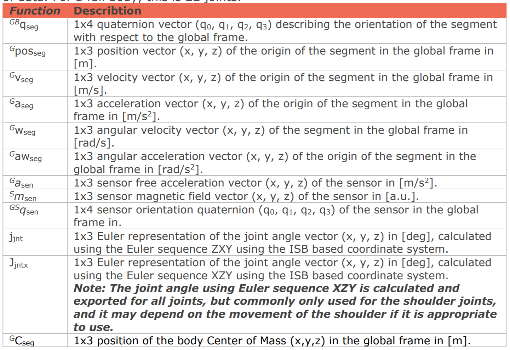
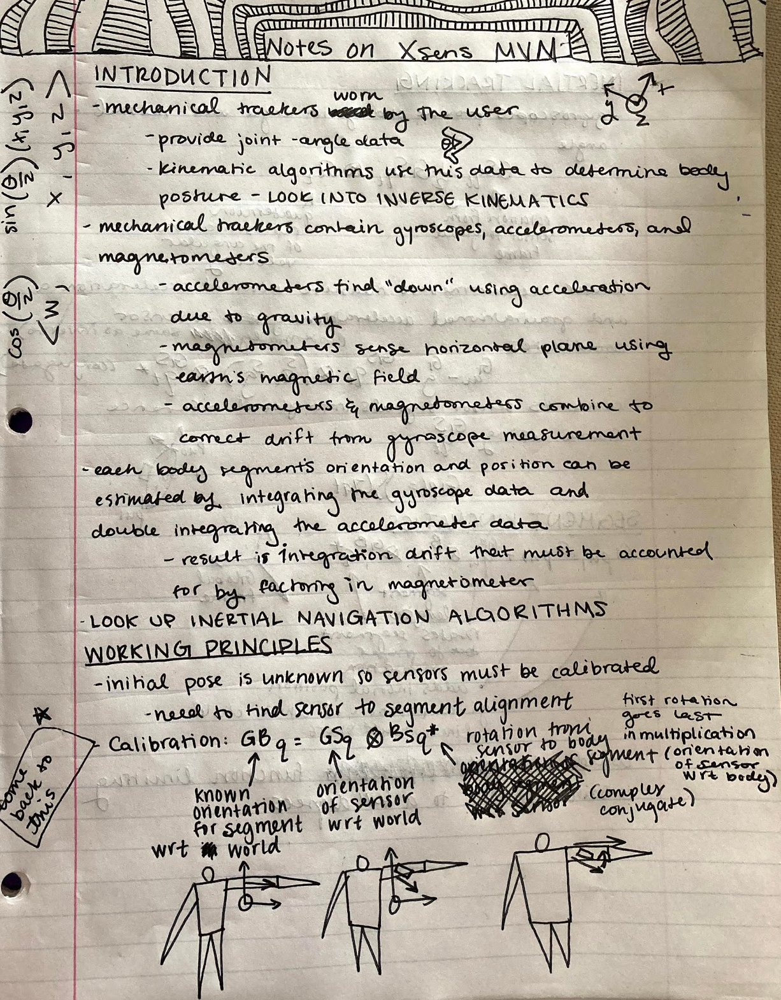
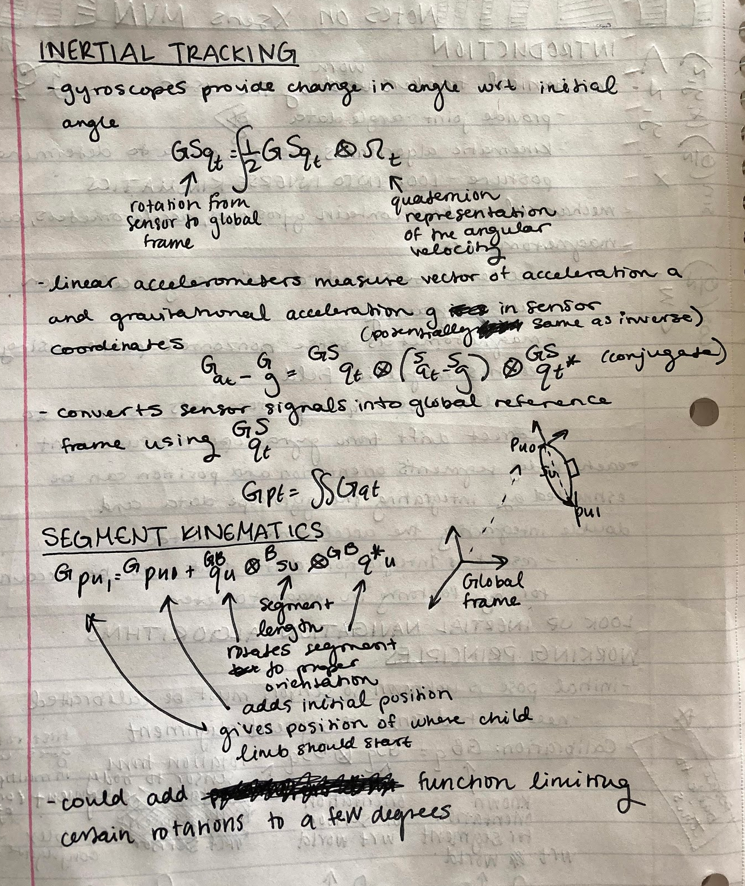
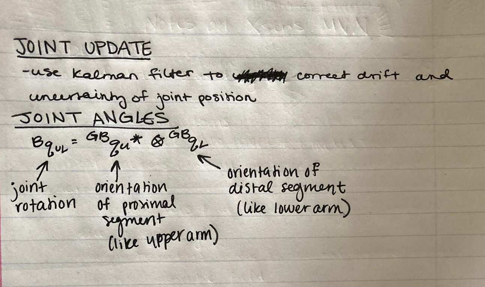

## 5/29/2021
- I have two ideas that I will be looking into more today. 
  - In yesterdays meeting, we were discussing how to deal with the identity quaternions being different between THREE and OPP worlds. What if we multipy the OPP Quaternion (pre or post I'm not sure yet) by the quaternions that would align the the body segment to the identity quaternion in OPP world thus making those quaternions the temporary idenity quaternions that the real rotations will be applied on top of.

  - Using [Article on LookAt Function](https://www.euclideanspace.com/maths/algebra/vectors/lookat/index.htm) to fix the bug in the other test I was working on
## 5/28/2021
- looking more into MVN software and requested a free trial (currently waiting on the activation link)
  - According to the website the free trial comes with preloaded data to work with. I'm thinking if I export that data into Excel, I can pull the quaternion values out of it and we can figure out how the sensor orientation quaternions correspond to the segment orientation quaternions (see chart)
  - By plugging the segment orientation quaternions into our current model, will we get a matching results as to what is running in the MVN program?
    - If so, we can work backwards and find the link between these quaternions and the OPP data
  - We can also use the visualization provided by the data to check ourselves before the OPP video footage becomes available

## 5/27/2021
- created simple THREE.js scene with stiff model made of cubes in an attempt to get the BACK IMU data displayed correctly
- oriented the camera so THREE.js coord system matches OPPORTUNITY coord system:
```
camera.position.x=5
camera.rotation.y=MATH.PI/2
camera.rotation.z=MATH.PI/2
```
 - With the rotation of the camera, I don't think any further adjustments will need to be made to the OPPORTUNITY quaternions to adjust for difference between THREE coord sys and global OPPORTUNITY coord sys

 - Technique for orienting block person correctly using OPP data:
    - take vector v=(-1,0,0) (the vector that should be pointing upwards along the spine in the sensor space) and apply OPP quaternion (normalized)
    - now v should be transformed from the sensor coord sys to the global OPPORTUNITY coord sys
    - use `blockPerson.pointAt(v)` and the local upwards vector of the blockPerson(the spine) should be in line with v and thus be in the correct orientation
 - Issues with current technique:
    - Doesn't take into account the rotation of the blockperson around the spine
      - Needs to have a similar function where vector v=(0,0,1) is transformed by the OPP quaternion and the face (front facing vector of the block person) is aligned to this vector
      - [WebGL2 : 136 : Quaternion Swing and Twist](https://www.youtube.com/watch?v=Hc2eHJUOEBE) (not sure if this video would help me to do that)
    - Not sure that the spine is correctly oriented at the moment
      - Can I assume that the sensors x axis ligns up perfectly with the back? Probably not
      - Does q0=q1, q1=q2, q2=q3, q3=q4 or q1=q1, q2=q2, q3=q3, q4=q0?
   

## 5/21/2021
- Researched [Quaternions](https://www.youtube.com/watch?v=SCbpxiCN0U0&list=PLW3Zl3wyJwWOpdhYedlD-yCB7WQoHf-My&index=32)
- Researched Similar Projects
  - [IMU-Based Human Motion Capture Systems](https://ps.is.mpg.de/research_projects/imu-mocap)
  - [Full-Body Locomotion Reconstruction of Virtual Characters Using a Single Inertial Measurement Unit](https://www.ncbi.nlm.nih.gov/pmc/articles/PMC5712795/)
  - [Human Motion Analysis with Wearable Inertial Sensors](https://trace.tennessee.edu/cgi/viewcontent.cgi?article=3070&context=utk_graddiss&httpsredir=1&referer=)
  - [MVN Sensors](https://www.researchgate.net/profile/Per-Slycke/publication/239920367_Xsens_MVN_Full_6DOF_human_motion_tracking_using_miniature_inertial_sensors/links/0f31752f1f60c20b18000000/Xsens-MVN-Full-6DOF-human-motion-tracking-using-miniature-inertial-sensors.pdf 
)
    - MVN Sensors Notes



    
## Background Research
- Read through documentation from previous project
- Reviewed notes on Linear Algebra
- Researched IMUs
    - [Accelerometers](https://www.youtube.com/watch?v=9WAckt2vrrQ)
    - [Gyroscopes](https://www.youtube.com/watch?v=ti4HEgd4Fgo)

